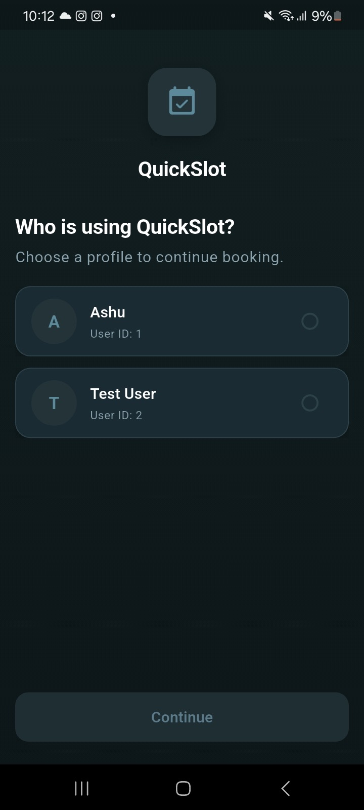
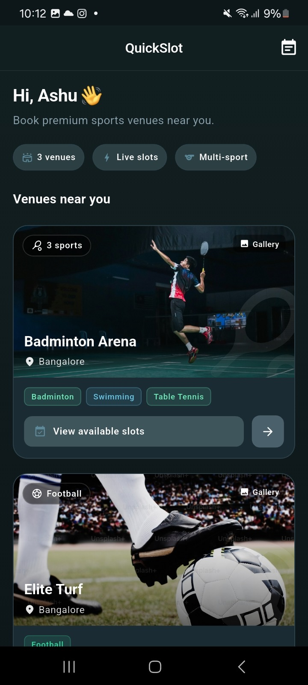
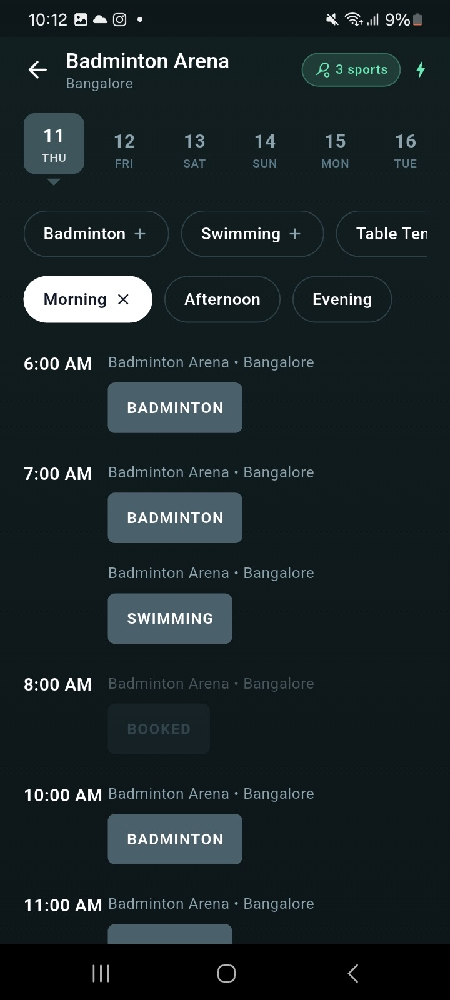
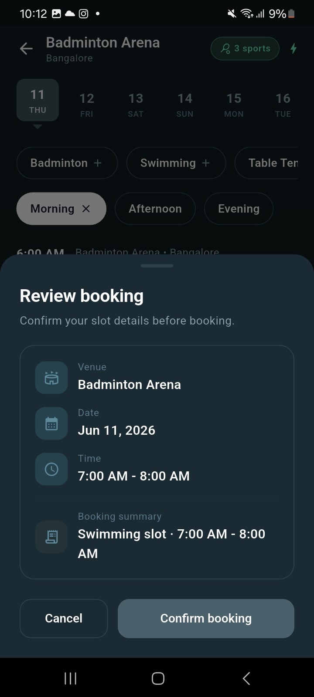
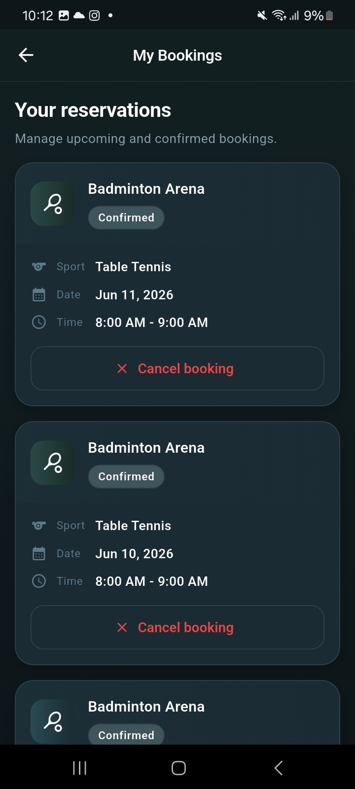

# QuickSlot

Sports venue slot booking app — browse venues, book time slots in real time, and manage reservations. Built with **Flutter** (mobile) and **Node.js + PostgreSQL** (API + WebSockets).

**Production API:** `https://quickslot-ashutosh2103-production.up.railway.app`

---

## Download APK (Android)

Install the release build on a physical Android device:

| | |
|---|---|
| **File** | [`quickslot_app/docs/apk/app-release.apk`](quickslot_app/docs/apk/app-release.apk) |

Download the APK from the link above, or rebuild locally:

```bash
cd quickslot_app
flutter pub get
flutter build apk --release
cp build/app/outputs/flutter-apk/app-release.apk docs/apk/
```

> Enable **Install from unknown sources** on your device, then open the APK file to install.

---

## Screenshots

Screenshots live in [`quickslot_app/docs/screenshots/`](quickslot_app/docs/screenshots/).

### User selection

Pick a demo user to simulate multi-user booking.



### Home — venues near you

Browse venues with cover photos, sport tags, and live slot indicators.



### Venue detail — slot booking

Select a date, filter by sport and time of day, and book available slots.



### Review booking

Confirm venue, date, time, and sport before reserving.



### My bookings

View and cancel confirmed reservations.



---

## Features

- **Multi-sport venues** — Filter slots by Badminton, Swimming, Table Tennis, and more
- **Live slot updates** — WebSocket pushes availability when another user books
- **Date & time filters** — Horizontal date picker + morning / afternoon / evening chips
- **Offline booking cache** — Cached bookings when the network is unavailable
- **Dark cult.fit-style UI** — Modern teal theme with venue cover images

---

## Project structure

```
quickSlot/
├── server/                         # Express REST API + Socket.IO
│   ├── server.js                   # Production entry (Railway)
│   ├── routes/                     # Venues, bookings
│   └── db/migrations/              # Sport + image migrations
└── quickslot_app/                  # Flutter mobile app
    ├── docs/
    │   ├── screenshots/            # App screenshots
    │   └── apk/app-release.apk   # Release APK
    └── lib/                        # Feature-based clean architecture
```

---

## Quick start (local)

### 1. Backend

```bash
cd server
npm install
# create .env with DATABASE_URL
npm run dev
```

API + WebSocket server: **http://localhost:3000**

Run migrations once:

```bash
psql $DATABASE_URL -f server/db/migrations/001_add_sport_support.sql
psql $DATABASE_URL -f server/db/migrations/002_add_venue_images.sql
```

### 2. Frontend

```bash
cd quickslot_app
flutter pub get
flutter run
```

Point at Railway in production (already configured as default):

```bash
flutter run \
  --dart-define=API_BASE_URL=https://quickslot-ashutosh2103-production.up.railway.app \
  --dart-define=SOCKET_URL=https://quickslot-ashutosh2103-production.up.railway.app
```

---

## Deployment

| Component | Platform | Notes |
|-----------|----------|-------|
| API + WebSocket | [Railway](https://railway.app) | Use root `railway.toml`, link `DATABASE_URL` |
| Database | Railway PostgreSQL | Run migrations in Query tab |
| Mobile | Local APK build | `flutter build apk --release` |

See [server/README.md](server/README.md) for full Railway setup.

---

## Documentation

- [Backend README](server/README.md) — API endpoints, database schema, WebSocket events
- [Frontend README](quickslot_app/README.md) — Flutter setup, architecture, demo flow

---

## Demo flow

1. Open app → select user (**Ashu** or **Test User**)
2. Browse venues on the home screen
3. Tap a venue → pick date → filter sport/time → book a slot
4. Confirm booking in the review sheet
5. Open **My Bookings** to view or cancel
6. Switch users to show separate booking lists and live slot updates

---

## Tech stack

| Layer | Stack |
|-------|-------|
| Mobile | Flutter, flutter_bloc, go_router, Dio, Hive |
| Backend | Node.js, Express 5, PostgreSQL, Socket.IO |
| Deploy | Railway |
